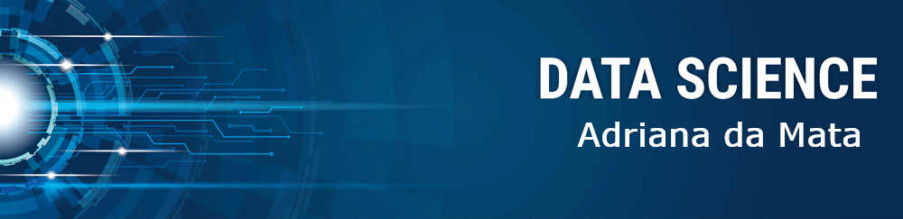

  

# Adriana da Mata
*Data Scientist*

Como professora de Computação e Cientista de Dados eu possuo habilidades de pesquisa e de compartilhamento do que acredito agregar valor às pessoas. Sou comunicativa e gosto de trabalhar em equipe. Como professora, sou disseminadora da filosofia proposta pelo Manifesto Ágil e acredito na potência das metodologias ágeis. Após passar os últimos anos no estudo de Métodos Matemáticos e Problemas Inversos, encontrei no Data Science agilidade e melhoria de qualidade em minhas pesquisas. Faço doutorado em Engenharia Mecânica - UFES. No mestrado, trabalhei com Inferência bayesiana na estimação do crescimento de tumores.
Recentemente, atuei como professora substituta no Departamento de Computação - UFES Alegre. Dei aula de disciplinas como: Algoritmos Numéricos, Programação, Lógica, Teoria Geral de Sistemas, Gerência de Projetos de Software e Introdução a Sistemas de Informação.

**Links:**
* [LinkedIn](https://www.linkedin.com/in/adriana-da-mata)
* [Medium](https://medium.com/@adriana.damata.prof)
* [GitHub](https://github.com/adrianadamata)

## Projetos:

* **Agenda de Consultório - Desafio ITIX:** https://github.com/adrianadamata/AgendaConsultorio
